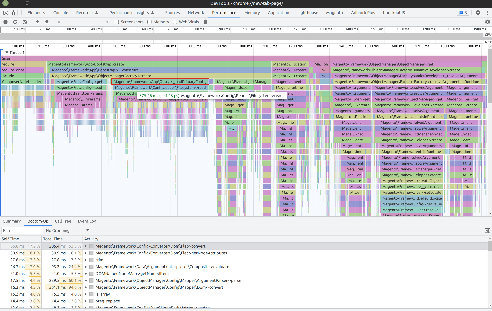
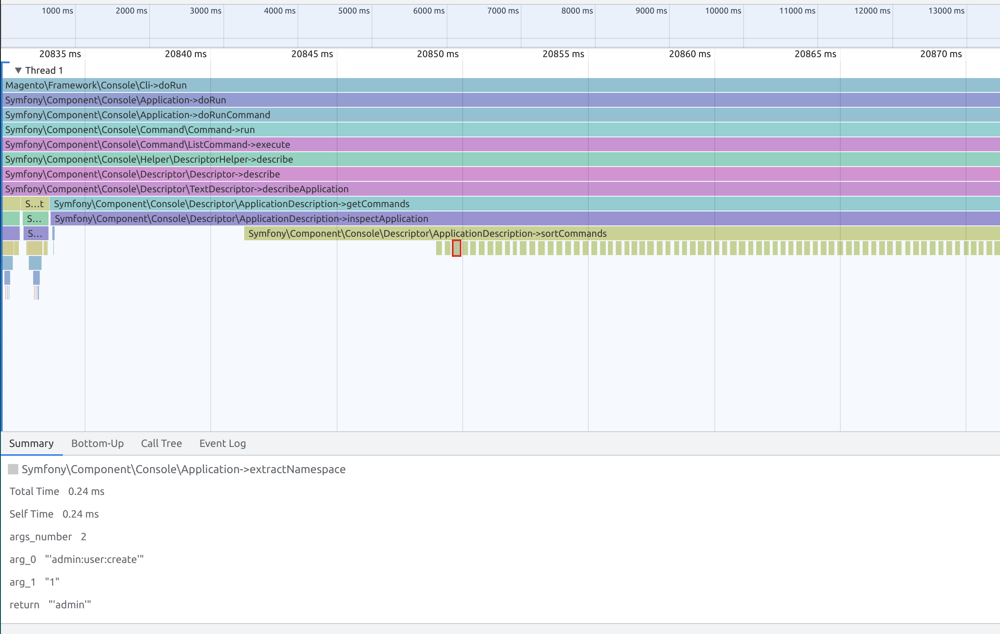
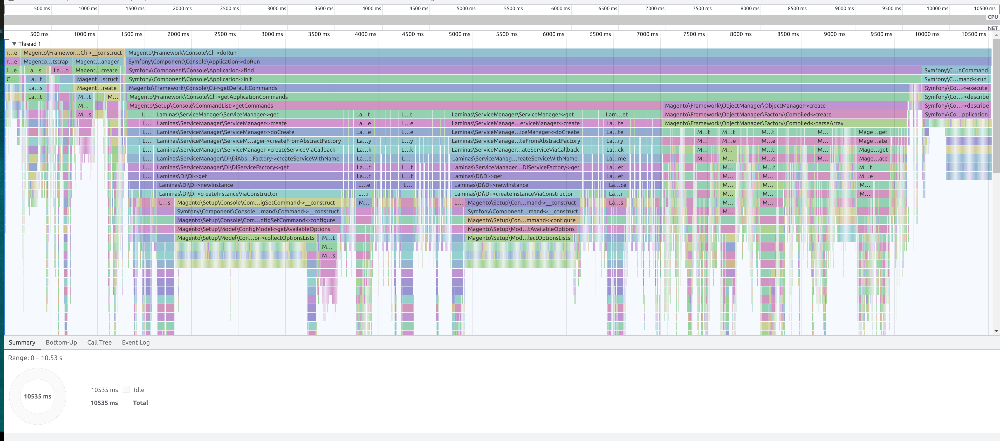
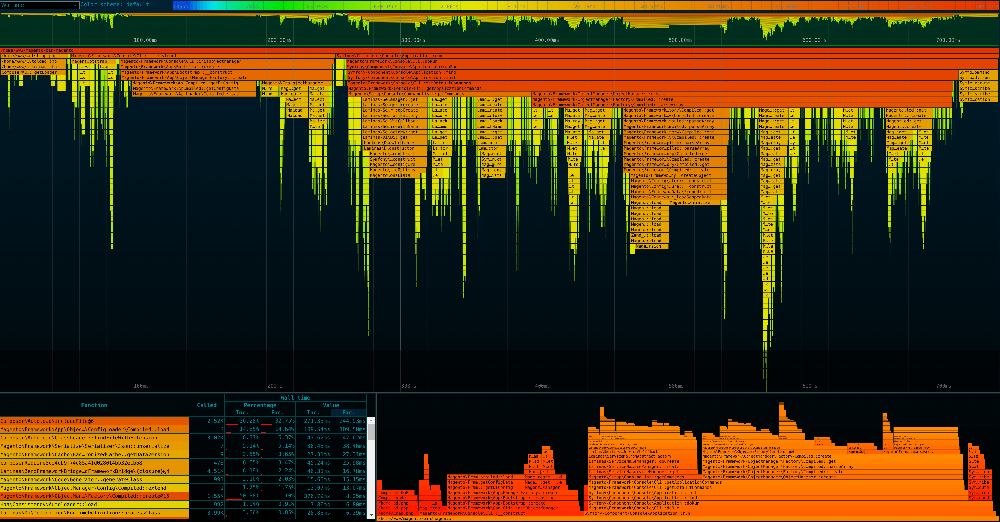

# xDebug Chromium Trace Converter

This is a tool for converting xDebug traces into Chromium format that can be visualized in browser's performance tab.


## Features

- Converts xDebug trace files into the JSON format used by Chromium
- Command-line interface for easy integration into automated workflows

## Requirements

- PHP 8.1 or later
- xDebug 3+ with `xdebug.trace_format=1` INI setting

## Installation via Composer
- Using composer
```
composer require ilnytskyi/xtc
```

- As dev only dependency
```
composer require --dev ilnytskyi/xtc
```

## Installation from git
1. Clone or download this repository to your local machine
2. Add `xtc` script to suitable location of your project or link globally
```
ln -s $(pwd)/xtc /usr/local/bin/xtc
```
3. Use `xtc` script commands to convert your xDebug traces

## Usage

For CLI scripts it's recommended to wrap call into `trace` command:
```
./vendor/bin/xtc trace --cmd="script.php"
```

To see exact wrapper command use `--debug` flag. Try to do self check
```
./vendor/bin/xtc trace --debug --cmd="./vendor/bin/xtc --help"
```

The xtc wraps call with correct xDebug params.
The output should be like this:
```
www@3f62bf5fbb1d:~$ ./vendor/bin/xtc trace --debug --cmd="./xtc --help"
Tracing: ./vendor/bin/xtc --help

/app_root/vendor/bin/xtc:564:
string(255) "XDEBUG_MODE=trace XDEBUG_TRIGGER=PHPSTORM /usr/bin/php8.1 -d xdebug.collect_return=0 -d xdebug.collect_params=0 -d xdebug.collect_assignments=0 -d xdebug.trace_format=1 -d xdebug.trigger_value="PHPSTORM" -d xdebug.trace_output_name=xtc_trace.%t xtc --help"

Unknown command: --help
Available commands: trace, convert, watch

Converting /app_root/var/xdebug_dumps/xtc_trace.1699803846.xt

The trace file:                   /app_root/var/xdebug_dumps/xtc_trace.1699803846.xt
Will be processed to:             /app_root/var/xdebug_dumps/xtc_trace.1699803846.xt.json
With following convertOptions
 Show internal PHP functions:     0
 Show arguments:                  0
 Sampling:                        0 μs
Trace is processed successfully /app_root/var/xdebug_dumps/xtc_trace.1699803846.xt.json
```
Now the `/app_root/var/xdebug_dumps/xtc_trace.1699803846.xt.json` file can be visualized in a trace viewer.

Generate xDebug traces manually
```
XDEBUG_MODE=trace XDEBUG_TRIGGER=PHPSTORM php {script.php}

#to capture functions return values
XDEBUG_MODE=trace XDEBUG_TRIGGER=PHPSTORM php -d xdebug.collect_return=1 {script.php}
```

To convert an xDebug trace file, use the `xtc` command and specify the input:
```
./vendor/bin/xtc convert --file=xdebug/dumps/{trace.file}
```
To automatically move converted JSON traces specify the `--out` options with filename or folder
```
./vendor/bin/xtc convert --file=xdebug/dumps/{trace.file} --out=destination/folder/my_trace.json
#OR
./vendor/bin/xtc convert --file=xdebug/dumps/{trace.file} --out=destination/folder/
```
To watch specific directory

```
./vendor/bin/xtc watch --dir=xdebug/dumps/
```
Use same parameters as in `convert` command to apply to profiles.

### Arguments and Return values:

xDebug trace file might collect return values of functions is running with `xdebug.collect_return=1` INI setting.\
The arguments can also be collected with `xdebug.collect_params=1` INI setting.\
When trace is converted with `--args=1` option you can see the values were passed to function and returned.\
Timeline visualization might be extremely useful for debugging or reverse engineering

```
./vendor/bin/xtc convert --file=xdebug/dumps/{trace.file} --args=1
```


Use `--help` option to see more details about command
```
./vendor/bin/xtc convert --help
./vendor/bin/xtc watch --help
```

## Notice about performance measurement:
- Tracing with xDebug add significant overhead and might increase script execution time by x10!

Here is an example of tracing of same script:
- with xDebug ~10s

- with SPX ~1s


Although the visualized traces of both profilers look similar, it's noticeable that xDebug took about x10 to execute.

- If your goal is to analyze performance it's recommended to use profiler with lower overhead than xDebug.
- If you need more information like arguments/returns values during the execution, you can use xDebug and convert the trace with `./vendor/bin/xtc` for more convenient analysis.
- xDebug also collects all calls of php internal functions, but they are excluded by `./vendor/bin/xtc` by default. Use `--internal=1` if you want to see them on timeline. 

## Visualisation

1. Chrome DevTools Performance Tab `Ctr+Shift+J -> Performance`
2. https://ui.perfetto.dev
3. https://www.speedscope.app
4. Any other Chromium trace (Google Trace Event Format) viewers

## Inspired By

- https://github.com/NoiseByNorthwest/php-spx
- https://github.com/xdebug/xdebug